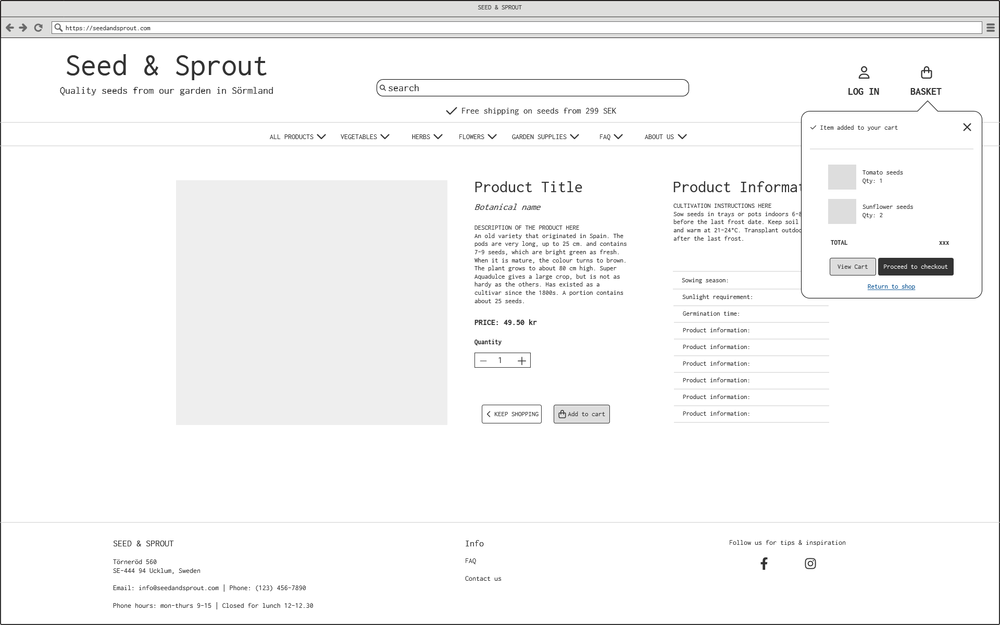

# Seed & Sprout

Link to live website: [CLICK HERE!](https://seedandsprout-ab1eae7ba537.herokuapp.com/)


Welcome to **Seed & Sprout** a fictional e-commerce website. It is a B2C platform, where the user can purchase seeds and gardening supplies.
This project was built by mainly using Django and it incorporates Stripe payments. The site enables user roles, authentication, and Full CRUD for products, allowing interaction with a central dataset securely.

- - -
## Testing the payment process
Please note that this project does not process real payments or fulfill shipments. You are welcome to test the payment functionality by using the provided card details when prompted:
- Card number for payment testing: 4242 4242 4242 4242
- Enter any future date for card expiry.
- Enter any 3-digit number for CVC.
- - -
## UX
The theme of the project is seeds and gardening supplies, so I wanted to use a color palette that gives an eco-friendly and sustainable vibe.

### Colour Scheme
I used [coolors.co](https://coolors.co/2d2a1b-99a885-eec782-e9995c-f6f5ef) to generate my colour palette.


I've also used CSS `:root` variables to easily update the global colour scheme.

```css
:root {
    --primary-black: #2D2A1B;
    --primary-offwhite: #F6F5EF;
    --primary-orange: #E9995C;
    --primary-yellow: #EEC782;
    --primary-green: #99A885;
    --color-white: #FFFEFA;
    --color-grey: #b4b4b1;
    
    --box-shadow: rgba(0, 0, 0, 0.16) 0px 1px 4px;
    --btn-box-shadow: box-shadow: rgba(0, 0, 0, 0.05) 0px 6px 24px 0px, rgba(0, 0, 0, 0.08) 0px 0px 0px 1px;

    --toast-success: #A8B99C;
    --toast-info: #95b0b4;
    --toast-warning: #E6B87D;
    --toast-error: #da664c;
}
```
### Typography
I used [Reddit Mono](https://fonts.google.com/specimen/Reddit+Mono) for all text in various font-sizes and weights. 
Reasons why I chose Reddit Mono:
- *Readability*: 
Reddit Mono is a monospaced font, which means that each character occupies the same amount of horizontal space. This uniformity enhances readability, especially for product descriptions and specifications, making it easier for customers to scan through information quickly.
- *Modern Aesthetic*:
Reddit Mono has a clean and modern appearance, which contributes to a professional image for this e-commerce site. A contemporary font can attract users and create a positive first impression, essential for online retail.
- *Versatility*:
Monospaced fonts, as Reddit Mono, are versatile and can be effectively used for various text elements, including headings and body text. This flexibility allows for a cohesive design throughout the website.

- - -
## Wireframes
Here are some wireframes that I created using [Balsamiq](https://balsamiq.com/). Note that some details shown in the wireframes may not match the final result. These wireframes act as a primary guide though, and the main structure and elements are depticted as shown here.

> **Homepage**
<details>
<summary>Homepage Desktop</summary>
    

</details>

> **Products page**
<details>
<summary>Products Desktop</summary>
    

</details>

> **Products detail page**
<details>
<summary>Products Detail Desktop</summary>
    

</details>

> **Add to cart page**
<details>
<summary>Add to cart Desktop</summary>
    

</details>

> **Shopping bag page**
<details>
<summary>Shopping bag Desktop</summary>
    

</details>

> **Checkout page**
<details>
<summary>Checkout Desktop</summary>
    

</details>

> **FAQ page**
<details>
<summary>FAQ Desktop</summary>
    

</details>

> **About page**
<details>
<summary>About Desktop</summary>
    

</details>

- - -

## Agile Development Process

### GitHub Projects
[GitHub Projects](https://github.com/users/KikiBerg/projects/8) was used as an Agile tool for this project.
There are probaply more ideal tools out there, but for now it served its purpose.
I used this tool for planning my user stories & issues, then followed up now and then using the Kanban board. 


### GitHub Issues
[GitHub Issues](https://github.com/KikiBerg/pp5-ecommerce/issues/) was also used as an Agile tool.
I created my own **User Story Template** in order to manage the user stories.

- [Open Issues](https://github.com/KikiBerg/pp5-ecommerce/issues?q=is%3Aopen):
I placed these to a **Backlog** column as they are features that were not prioritized and are seen as possible future implementations.

- [Closed Issues](https://github.com/KikiBerg/pp5-ecommerce/issues?q=is%3Aissue+is%3Aclosed) 

### MoSCoW Prioritization

I've prioritized my user stories using this method and used labels for my user stories within the Issues tab.

- **Must Have**: guaranteed to be delivered 
- **Should Have**: adds significant value, but not vital 
- **Could Have**: has small impact if left out 
- **Won't Have**: not a priority for this iteration

- - -

### User Stories

I created the user stories in the beginning of the project so that I could better organize the structure of the site. 
Some of the stories were adjusted during the working process, so as to better fit my final ideas.
| Title | User Story | Subcategory | MoSCoW Priority | 
| --- | --- | --- | --- |
| View a list of products | As a **shopper**  I want to be able to **view a list of products** so that I can **select some to purchase** | Viewing & Navigation | Must Have |
| View individual product details | As a **shopper**  I want to be able to **view individual product details** so that I can **identify the price, description, product rating & product** | Viewing & Navigation | Must Have |
| Comment on Posts | As a **registered user** I want to **comment on posts** so that I can **participate in discussions and provide feedback.** | Must Have |
| Moderate comments | As a **site admin** I want to **moderate comments, including editing and deleting comments** so that I can **manage community interactions and discussions.** | Must Have |
| Manage Posts | As a **site admin** I want to **moderate posts, including creating, updating, and deleting posts** so that I can **maintain content quality and relevance.** | Must Have |
| Create a new post | As a **site admin** I want to **create a new post by entering a title and content** so that I can **share new content with others.** | Must Have |
| Manage User Accounts | As a **site admin** I want to **manage users, including editing and deleting user accounts** so that I can **ensure the integrity and safety of the community.** | Must Have |
| Group Posts by Category | As a **registered user** I want to **view posts that belong to a specific category** so that I can **read and explore the content more easily.** | Must Have |
| Manage Categories | As a **registered user** I want to **manage my own categories, including adding, editing, and deleting categories** so that I can **contribute to the content of the platform.** | Should Have |
| Manage Categories | As a **site admin** I want to **manage all categories, including adding, editing, and deleting categories** so that I can **organize content effectively.** | Should Have |
| Search categories | As a **site admin** I want to **search through the various post categories** so that I can **find the posts that I'm more interested in.** | Should Have |
| Update About Page Content | As a **site admin** I want to **view and edit the About page** so that I can **update information about the website.** | Could Have |
| View About Page | As a **new user** I want to **view the About page** so that I can **learn more about the website and its purpose.** | Could Have |
| Search posts | As a **new user** I want to **be able to search for posts by title or content** so that I can **easily find what I'm most interested in.** | Won't Have |
| Upvote or Downvote Posts | As a **registered user** I want to **be able to upvote or downvote posts** so that I can **express my opinion on the content quality.** | Won't Have |
