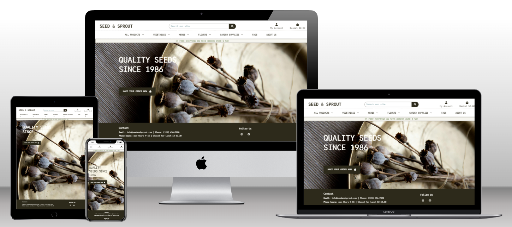

# Seed & Sprout

Link to live website: [CLICK HERE!](https://seedandsprout-ab1eae7ba537.herokuapp.com/)



Welcome to **Seed & Sprout** a fictional e-commerce website. It is a B2C platform, where the user can purchase seeds and gardening supplies.
This project was built by mainly using Django and it incorporates Stripe payments. The site enables user roles, authentication, and Full CRUD for products, allowing interaction with a central dataset securely.

- - -
## Testing the payment process
Please note that this project does not process real payments or fulfill shipments. You are welcome to test the payment functionality by using the provided card details when prompted:
- Card number for payment testing: 4242 4242 4242 4242
- Enter any future date for card expiry.
- Enter any 3-digit number for CVC.
- - -
## UX
The theme of the project is seeds and gardening supplies, so I wanted to use a color palette that gives an eco-friendly and sustainable vibe.

### Colour Scheme
I used [coolors.co](https://coolors.co/2d2a1b-99a885-eec782-e9995c-f6f5ef) to generate my colour palette.


I've also used CSS `:root` variables to easily update the global colour scheme.

```css
:root {
    --primary-black: #2D2A1B;
    --primary-offwhite: #F6F5EF;
    --primary-orange: #E9995C;
    --primary-yellow: #EEC782;
    --primary-green: #99A885;
    --color-white: #FFFEFA;
    --color-grey: #b4b4b1;
    
    --box-shadow: rgba(0, 0, 0, 0.16) 0px 1px 4px;
    --btn-box-shadow: box-shadow: rgba(0, 0, 0, 0.05) 0px 6px 24px 0px, rgba(0, 0, 0, 0.08) 0px 0px 0px 1px;

    --toast-success: #A8B99C;
    --toast-info: #95b0b4;
    --toast-warning: #E6B87D;
    --toast-error: #da664c;
}
```
### Typography
I used [Reddit Mono](https://fonts.google.com/specimen/Reddit+Mono) for all text in various font-sizes and weights. 
Reasons why I chose Reddit Mono:
- *Readability*: 
Reddit Mono is a monospaced font, which means that each character occupies the same amount of horizontal space. This uniformity enhances readability, especially for product descriptions and specifications, making it easier for customers to scan through information quickly.
- *Modern Aesthetic*:
Reddit Mono has a clean and modern appearance, which contributes to a professional image for this e-commerce site. A contemporary font can attract users and create a positive first impression, essential for online retail.
- *Versatility*:
Monospaced fonts, as Reddit Mono, are versatile and can be effectively used for various text elements, including headings and body text. This flexibility allows for a cohesive design throughout the website.

- - -
## Wireframes
Here are some wireframes that I created using [Balsamiq](https://balsamiq.com/). Note that some details shown in the wireframes may not match the final result. These wireframes act as a primary guide though, and the main structure and elements are depticted as shown here.

> **Homepage**
<details>
<summary>Homepage Desktop</summary>
    

</details>

> **Products page**
<details>
<summary>Products Desktop</summary>
    

</details>

> **Products detail page**
<details>
<summary>Products Detail Desktop</summary>
    

</details>

> **Add to cart page**
<details>
<summary>Add to cart Desktop</summary>
    

</details>

> **Shopping bag page**
<details>
<summary>Shopping bag Desktop</summary>
    

</details>

> **Checkout page**
<details>
<summary>Checkout Desktop</summary>
    

</details>

> **FAQ page**
<details>
<summary>FAQ Desktop</summary>
    

</details>

> **About page**
<details>
<summary>About Desktop</summary>
    

</details>

- - -

## Agile Development Process

### GitHub Projects
[GitHub Projects](https://github.com/users/KikiBerg/projects/8) was used as an Agile tool for this project.
There are probaply more ideal tools out there, but for now it served its purpose.
I used this tool for planning my user stories & issues, then followed up now and then using the Kanban board. 


### GitHub Issues
[GitHub Issues](https://github.com/KikiBerg/pp5-ecommerce/issues/) was also used as an Agile tool.
I created my own **User Story Template** in order to manage the user stories.

- [Open Issues](https://github.com/KikiBerg/pp5-ecommerce/issues?q=is%3Aopen):
I placed these to a **Backlog** column as they are features that were not prioritized and are seen as possible future implementations.

- [Closed Issues](https://github.com/KikiBerg/pp5-ecommerce/issues?q=is%3Aissue+is%3Aclosed) 

### MoSCoW Prioritization

I've prioritized my user stories using this method and used labels for my user stories within the Issues tab.

- **Must Have**: guaranteed to be delivered 
- **Should Have**: adds significant value, but not vital 
- **Could Have**: has small impact if left out 
- **Won't Have**: not a priority for this iteration

- - -

### User Stories

I created the user stories in the beginning of the project so that I could better organize the structure of the site. 
Some of the stories were adjusted during the working process, so as to better fit my final ideas.
| Title | User Story | Subcategory | MoSCoW Priority | 
| --- | --- | --- | --- |
| View a list of products | As a **shopper**  I want to be able to **view a list of products** so that I can **select some to purchase** | Viewing & Navigation | Must Have |
| View individual product details | As a **shopper**  I want to be able to **view individual product details** so that I can **identify the price, description, product rating & product image** | Viewing & Navigation | Must Have |
| View total of my purchase | As a **shopper**  I want to be able to **easily view the total of my purchases at any time** so that I can **avoid spending too much** | Viewing & Navigation | Must Have |
| View specific category of products | As a **shopper**  I want to be able to **view a specific category of products** so that I can **quickly find products I'm interested in without having to search through all products** | Viewing & Navigation | Must Have |
| Register for an account | As a **site user**  I want to be able to **easily register for an account** so that I can **have a personal account & be able to view my profile** | Registration & User Accounts | Should Have |
| Login & logout | As a **site user**  I want to be able to **easily login & logout** so that I can **access my personal account information** | Registration & User Accounts | Should Have |
| Recover password | As a **site user**  I want to be able to **easily recover my password in case I forget it** so that I can **recover access to my account** | Registration & User Accounts | Should Have |
| Email confirmation | As a **site user**  I want to be able to **receive an email confirmation after registering** so that I can **verify that my account registration was successful** | Registration & User Accounts | Should Have |
| User profile | As a **site user**  I want to be able to **have a personalized user profile** so that I can **view my personal order history, order confirmations & save my payment information** | Registration & User Accounts | Should Have |
| Sort available products | As a **shopper**  I want to be able to **sort the list of available products** so that I can **easily identify the best rated, best priced & categorically sorted products** | Sorting & Searching | Should Have |
| Sort specific category | As a **shopper**  I want to be able to **sort a specific category** so that I can **find the best-priced or best-rated product in a specific category or sort the products in that category by name** | Sorting & Searching | Should Have |
| Sort multiple categories | As a **shopper**  I want to be able to **sort multiple product categories simultaneously** so that I can **find the best-priced or best-rated products across broad categories, such as "Vegetable seeds" or "Organic seeds"** | Sorting & Searching | Should Have |
| Search by name or description | As a **shopper**  I want to be able to **search for a product by name or description** so that I can **find a specific product I'd like to purchase** | Sorting & Searching | Should Have |
| Search overview | As a **shopper**  I want to be able to **easily overview what I've searched for & the number of the results** so that I can **quickly decide whether the product I want is available** | Sorting & Searching | Should Have |
| Select quantity | As a **shopper**  I want to be able to **select the quantity of a product when purchasing it** so that I can **ensure I don't accidentally select the wrong product or quantity** | Purchasing & Checkout | Should Have |
| View bag items | As a **shopper**  I want to be able to **view my bag items** so that I can **identify the total cost of my purchase and all items I will receive** | Purchasing & Checkout | Should Have |
| Adjust quantity of specific items | As a **shopper**  I want to be able to **adjust the quantity of specific items in my bag** so that I can **easily make changes to my purchase before checkout** | Purchasing & Checkout | Should Have |
| Enter payment information | As a **shopper**  I want to be able to **easily enter my payment information** so that I can **checkout effectively** | Purchasing & Checkout | Should Have |
| Secure information | As a **shopper** I want to be able to **feel my personal & payment info is safe & secure** so that I can **confidently provide the information needed for the purchase** | Purchasing & Checkout | Should Have |
| Order confirmation | As a **shopper** I want to be able to **view an order confirmation after checkout** so that I can **verify that I haven't made mistakes** | Purchasing & Checkout | Should Have |
| Add a product | As a **store owner** I want to be able to **add a product** so that I can **add new items to my store** | Admin & Store Management | Must Have |
| Update a product | As a **store owner** I want to be able to **update a product** so that I can **change product prices, descriptions, images & other criteria** | Admin & Store Management | Must Have |
| Delete a product | As a **store owner** I want to be able to **delete a product** so that I can **remove items that are no longer for sale** | Admin & Store Management | Must Have |
| Delete a product | As a **store owner** I want to be able to **delete a product** so that I can **remove items that are no longer for sale** | Admin & Store Management | Must Have |