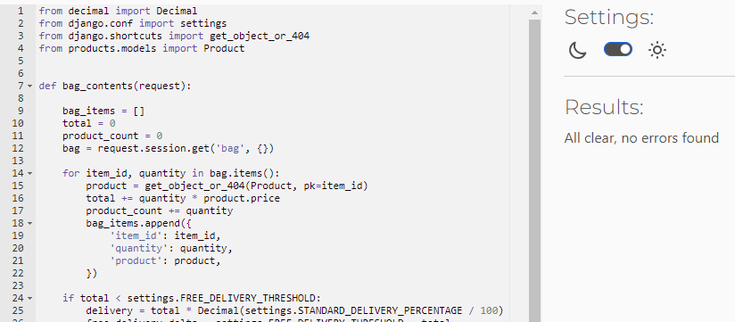
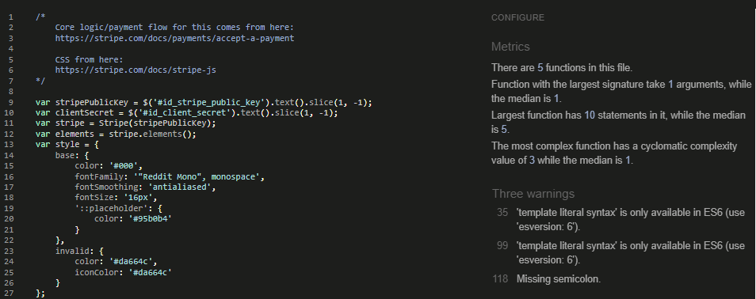
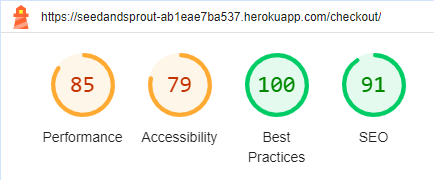
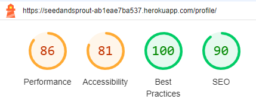
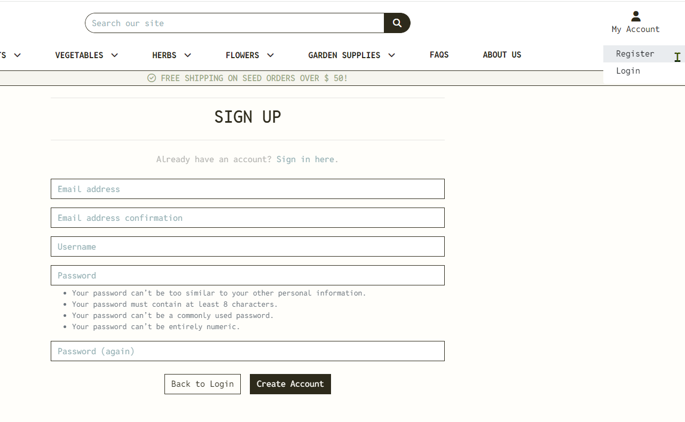
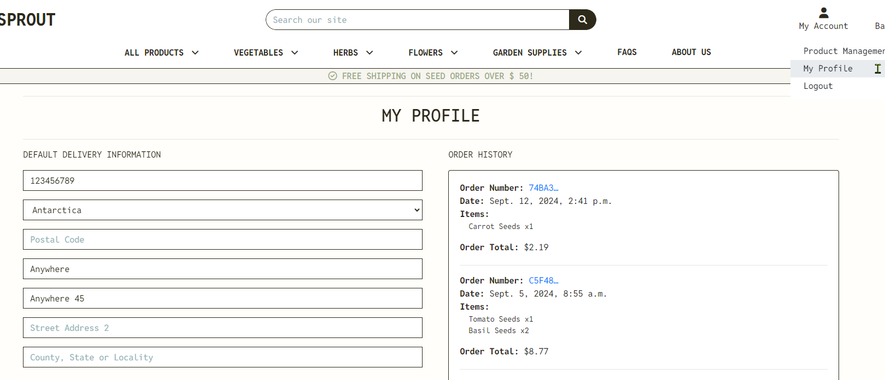
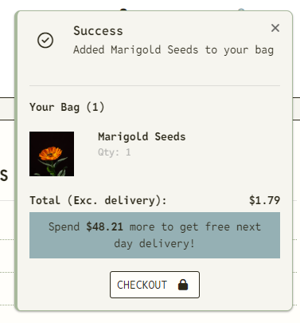
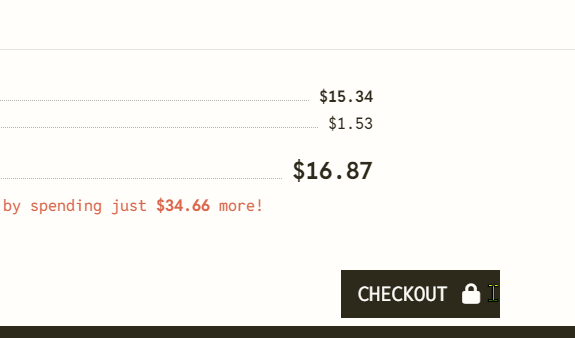

# Seed & Sprout - Testing

Visit the deployed site: [Seed & Sprout](https://seedandsprout-ab1eae7ba537.herokuapp.com/)

Return back to the [README.md](README.md) file.

- - -

## AUTOMATED TESTING

### Code Validation

- [CI Python Linter](https://pep8ci.herokuapp.com/) was used to validate all the Python files.
- [W3C](https://validator.w3.org/) was used to validate the HTML and CSS.
- [JSHint](https://jshint.com/) was used to validate the Javascript.

#### CI Python Linter
**`about app`**
File | Screenshot | Notes |
| --- | --- | --- | 
| about/admin.py |  | Passed. No warnings or errors |
| about/apps.py |  | Passed. No warnings or errors |
| about/forms.py |  | Passed. No warnings or errors |
| about/models.py |  | Passed. No warnings or errors |
| about/urls.py |  | Passed. No warnings or errors |
| about/views.py |  | Passed. No warnings or errors |

**`bag app`**
File | Screenshot | Notes |
| --- | --- | --- | 
| bag/apps.py |  | Passed. No warnings or errors |
| bag/contexts.py |  | Passed. No warnings or errors |
| bag/urls.py |  | Passed. No warnings or errors |
| bag/views.py |  | Passed. No warnings or errors |
| bag/views.py |  | Passed. No warnings or errors |

**`checkout app`**
File | Screenshot | Notes |
| --- | --- | --- | 
| checkout/admin.py |  | Passed. No warnings or errors |
| checkout/apps.py |  | Passed. No warnings or errors |
| checkout/forms.py |  | Passed. No warnings or errors |
| checkout/models.py |  | Passed. No warnings or errors |
| checkout/signals.py |  | Passed. No warnings or errors |
| checkout/urls.py |  | Passed. No warnings or errors |
| checkout/views.py |  | Passed. No warnings or errors |
| checkout/webhook_handler.py|  | Passed. No warnings or errors |
| checkout/webhooks.py|  | Passed. No warnings or errors |

**`faqs app`**
File | Screenshot | Notes |
| --- | --- | --- | 
| faqs/admin.py |  | Passed. No warnings or errors |
| faqs/apps.py |  | Passed. No warnings or errors |
| faqs/forms.py |  | Passed. No warnings or errors |
| faqs/models.py |  | Passed. No warnings or errors |
| faqs/urls.py |  | Passed. No warnings or errors |
| faqs/views.py |  | Passed. No warnings or errors |

**`home app`**
File | Screenshot | Notes |
| --- | --- | --- |
| home/apps.py |  | Passed. No warnings or errors |
| home/urls.py |  | Passed. No warnings or errors |
| home/views.py |  | Passed. No warnings or errors |

**`newsletter app`**
File | Screenshot | Notes |
| --- | --- | --- | 
| newsletter/admin.py |  | Passed. No warnings or errors |
| newsletter/apps.py |  | Passed. No warnings or errors |
| newsletter/forms.py |  | Passed. No warnings or errors |
| newsletter/models.py |  | Passed. No warnings or errors |
| newsletter/urls.py |  | Passed. No warnings or errors |
| newsletter/views.py |  | Passed. No warnings or errors |

**`products app`**
File | Screenshot | Notes |
| --- | --- | --- | 
| products/admin.py |  | Passed. No warnings or errors |
| products/apps.py |  | Passed. No warnings or errors |
| products/forms.py |  | Passed. No warnings or errors |
| products/models.py |  | Passed. No warnings or errors |
| products/urls.py |  | Passed. No warnings or errors |
| products/views.py |  | Passed. No warnings or errors |
| products/widgets.py |  | Passed. No warnings or errors |

**`profiles app`**
File | Screenshot | Notes |
| --- | --- | --- | 
| profiles/apps.py |  | Passed. No warnings or errors |
| profiles/forms.py |  | Passed. No warnings or errors |
| profiles/models.py |  | Passed. No warnings or errors |
| profiles/urls.py |  | Passed. No warnings or errors |
| profiles/views.py |  | Passed. No warnings or errors |

**`seed_and_sprout`**
File | Screenshot | Notes |
| --- | --- | --- | 
| settings.py |  | Passed. No warnings or errors |
| urls.py |  | Passed. No warnings or errors |
| views.py |  | Passed. No warnings or errors |
| wsgi.py |  | Passed. No warnings or errors |

#### W3C HTML Validator

Page | Screenshot | Notes |
| --- | --- | --- |
| **Homepage** |  | Passed. No warnings or errors |
| **Products page** |  | Passed. No warnings or errors |
| **Products add page** |  | Passed. No warnings or errors |
| **Products edit page** |  | Passed. No warnings or errors |
| **Products delete page** |  | Passed. No warnings or errors |
| **Products detail page** |  | Passed. No warnings or errors |
| **Bag page** |  | Passed. No warnings or errors |
| **Checkout page** |  | Passed. 1 warning, no errors |
| **Checkout success page** |  | Passed. No warnings or errors |
| **Faqs page** |  | Passed. No warnings or errors |
| **Faqs add page** |  | Passed. No warnings or errors |
| **Faqs edit page** |  | Passed. No warnings or errors |
| **Faqs delete page** |  | Passed. No warnings or errors |
| **Newsletter page** |  | Passed. No warnings or errors |
| **About page** |  | Passed. No warnings or errors |
| **Profile page** |  | Passed. No warnings or errors |
| **Signup page** |  | Error: "Element ul not allowed as child of element small in this context." I ignored this error, as it is a known one from the latest versions of allauth |
| **Signin page** |  | Passed. No warnings or errors |
| **Signout page** |  | Passed. No warnings or errors |

#### W3C CSS Validator

File | Screenshot | Notes |
| --- | --- | --- |
| **base.css** |  | Passed. No errors |
| **bag.css** |  | Passed. No errors |
| **checkout.css** |  | Passed. No errors |
| **faqs.css** |  | Passed. No errors |
| **home.css** |  | Passed. No errors |
| **products.css** |  | Passed. No errors |
| **product_detail.css** |  | Passed. No errors |
| **profile.css** |  | Passed. No errors |

#### JSHint Javascript Validator

File | Screenshot | Notes |
| --- | --- | --- |
| **stripe_elements.js** |  | Warnings about: 'const', 'let in ES6', 'arrow function syntax', 'template literal syntax in ES6'. I ignored these warnings. |
| **accordion.js** |  | Warnings about: 'const', 'let in ES6', 'arrow function syntax', 'template literal syntax in ES6'. I ignored these warnings. |
| **countryfield.js** |  | Warnings about: 'const', 'let in ES6', 'arrow function syntax', 'template literal syntax in ES6'. I ignored these warnings. |

- - -

### Lighthouse

I used Lighthouse within the Chrome Developer Tools to test the performance, accessibility, best practices and SEO of the website.

| Page | Screenshot |
| --- | --- | 
| **about** |  | 
| **accounts login** |  | 
| **accounts logout** |  | 
| **accounts signup** |  | 
| **bag** |  | 
| **checkout_success** |  |
| **checkout** |  |
| **faqs_add** |  |
| **faqs_delete** |  |
| **faqs_edit** |  |
| **faqs** |  |
| **home** |  |
| **newsletter_signup.png** |  |
| **products_add** |  |
| **products_delete** |  |
| **products_detail** |  |
| **products_edit** |  |
| **products** |  |
| **profile** |  |

- - -

### Responsiveness
- I have tested my deployed project on multiple devices to check for responsiveness issues. No issues were found.
- Apart from the Chrome Devtools, I've used [this site](https://techsini.com/multi-mockup/index.php) to quickly check responsiveness on different devices and get screenshots for the testing.md file.

`Home Page`
| Screenshot | Notes |
| --- | --- |
| | Works as expected |

`Products Page`
| Screenshot | Notes |
| --- | --- |
| | Works as expected |

`Products detail Page`
| Screenshot | Notes |
| --- | --- |
| | Works as expected |

`Faqs Page`
| Screenshot | Notes |
| --- | --- |
| | Works as expected |

`About Page`
| Screenshot | Notes |
| --- | --- |
| | Works as expected |

`Newsletter Page`
| Screenshot | Notes |
| --- | --- |
| | Works as expected |

`Login Page`
| Screenshot | Notes |
| --- | --- |
| | Works as expected |

`Sign up Page`
| Screenshot | Notes |
| --- | --- |
| | Works as expected |

`404 Page`
| Screenshot | Notes |
| --- | --- |
| | Works as expected |

- For the pages that are profile and authentication safe, I needed to take the screenshots myself as the links would not appear on techsini site.
- I took fullsize screenshots on small and medium screens.

`Bag Page`

Small (IPhone 12 Pro)

Medium (IPad Air)

    

`Checkout Page`

Small (IPhone 12 Pro)

Medium (IPad Air)

    

`Checkout Success Page`

Small (IPhone 12 Pro)

Medium (IPad Air)

    

`Product Add Page`

Small (IPhone 12 Pro)

Medium (IPad Air)

    

`Product Edit Page`

Small (IPhone 12 Pro)

Medium (IPad Air)

    

`Product Delete Page`

Small (IPhone 12 Pro)

Medium (IPad Air)

    

`Faqs Add Page`

Small (IPhone 12 Pro)

Medium (IPad Air)

    

`Faqs Edit Page`

Small (IPhone 12 Pro)

Medium (IPad Air)

    

`Faqs Edit Confirm Page`

Small (IPhone 12 Pro)

Medium (IPad Air)

    

`Faqs Delete Page`

Small (IPhone 12 Pro)

Medium (IPad Air)

    

`Profile Page`

Small (IPhone 12 Pro)

Medium (IPad Air)

    

- - -

### Browser Compatibility

I have tested my deployed project on two different browsers to check for compatibility issues. I could not find any issues.

|  Browser | Links  | Pages  | Responsivnes  | Form fields  |
| --- | --- | --- | --- | --- |
|  Chrome | Works as expected  |  Loading pages no issue | Responsivness works as expected  | Works as expected  |
|  Edge |  Works as expected | Loading pages no issue  | Responsivness works as expected  |  Works as expected |

- - -

## MANUAL TESTING

### Testing Purchase Procedure
Action |  Expected result | Pass
--- | --- | :---:
Click on 'All Products' |  All products are displayed on the page | &check;
Choose product, click on image or 'More Info' button |  Single product is displayed on the page with description & specifications | &check;
Click + on quantity |  Quantity of product increases | &check;
Click - on quantity |  Quantity of product decreases | &check;
Click 'add to bag' |  Product is added to shopping bag, success message is shown to the user | &check;
Click on the 'basket' icon in the navigation menu|  Redirected to shopping bag template, with products in it | &check;
Click + on quantity |  Quantity of product increases | &check;
Click - on quantity |  Quantity of product decreases | &check;
Click 'refresh' icon |  Quantity of products have been updated | &check;
To remove product, click 'remove'|  Product is removed from shopping bag| &check;
Click 'checkout'|  Redirected to checkout page | &check;
Fill in all form details |  No errors displayed on the form | &check;
In payment section input 4242 4242 4242 4242 and random date, cvc, zip & click complete order button | Payment went through, preview of purchase is displayed | &check;
Check email |  Email comfirmation has been sent | &check;

Order comfirmation

    

Stripe

    

Email comfirmation

    

### Testing User Stories
Here's a table for testing the various user stories of the project. The aim is to follow up the functionality implementation.

| Title | User Story | Response | 
| --- | --- | --- |
| View a list of products | As a **shopper**  I want to be able to **view a list of products** so that I can **select some to purchase** | |
| View individual product details | As a **shopper**  I want to be able to **view individual product details** so that I can **identify the price, description, product rating & product image** | |
| View total of my purchase | As a **shopper**  I want to be able to **easily view the total of my purchases at any time** so that I can **avoid spending too much** | |
| View specific category of products | As a **shopper**  I want to be able to **view a specific category of products** so that I can **quickly find products I'm interested in without having to search through all products** | |
| Register for an account | As a **site user**  I want to be able to **easily register for an account** so that I can **have a personal account & be able to view my profile** | |
| Login & logout | As a **site user**  I want to be able to **easily login & logout** so that I can **access my personal account information** | |
| Recover password | As a **site user**  I want to be able to **easily recover my password in case I forget it** so that I can **recover access to my account** | |
| Email confirmation | As a **site user**  I want to be able to **receive an email confirmation after registering** so that I can **verify that my account registration was successful** | |
| User profile | As a **site user**  I want to be able to **have a personalized user profile** so that I can **view my personal order history, order confirmations & save my payment information** | |
| Sort available products | As a **shopper**  I want to be able to **sort the list of available products** so that I can **easily identify the best rated & best priced sorted products** | |
| Sort specific category | As a **shopper**  I want to be able to **sort a specific category** so that I can **find the best-priced or best-rated product in a specific category or sort the products in that category by name** | |
| Sort multiple categories | As a **shopper**  I want to be able to **sort multiple product categories simultaneously** so that I can **find the best-priced or best-rated products across broad categories** |  |
| Search by name or description | As a **shopper**  I want to be able to **search for a product by name or description** so that I can **find a specific product I'd like to purchase** | |
| Search overview | As a **shopper**  I want to be able to **easily overview what I've searched for & the number of the results** so that I can **quickly decide whether the product I want is available** | |
| Select quantity | As a **shopper**  I want to be able to **select the quantity of a product when purchasing it** so that I can **ensure I don't accidentally select the wrong product or quantity** | |
| View bag items | As a **shopper**  I want to be able to **view my bag items** so that I can **identify the total cost of my purchase and all items I will receive** | |
| Adjust quantity of specific items | As a **shopper**  I want to be able to **adjust the quantity of specific items in my bag** so that I can **easily make changes to my purchase before checkout** | |
| Enter payment information | As a **shopper**  I want to be able to **easily enter my payment information** so that I can **checkout effectively** | |
| Order confirmation | As a **shopper** I want to be able to **view an order confirmation after checkout** so that I can **verify that I haven't made mistakes** | |
| Add a product | As a **store owner** I want to be able to **add a product** so that I can **add new items to my store** | |
| Update a product | As a **store owner** I want to be able to **update a product** so that I can **change product prices, descriptions, images & other criteria** | |
| Delete a product | As a **store owner** I want to be able to **delete a product** so that I can **remove items that are no longer for sale** | |
| Subscribe to newsletter | As a **site user** I want to be able to **subscribe to a newsletter by providing my email address** so that I can **get updates about new products** | |
| Manage subscriber list | As a **site admin** I want to be able to **view and manage the list of newsletter subscribers** so that I can **send newsletters periodically** | |
| View FAQs list | As a **site user** I want to be able to **view a list of FAQs grouped by categories** so that I can **more easily find answers to my questions** | |
| Add FAQs list | As a **site admin** I want to be able to **add new FAQs** so that I can **follow up questions from customers** | |
| Update FAQs list | As a **site admin** I want to be able to **edit existing FAQs** so that I can **keep the section up to date** | |
| Delete FAQs list | As a **site admin** I want to be able to **delete FAQs** so that I can **remove questions that are no longer for relevant** | |

- - -

### Defensive Programming

#### Navigation Menu
| Feature | Tested? | Action | Expected Outcome | Pass/Fail | Screenshots |
| --- | --- | --- | --- | --- | --- | 
| Sign In Link | Yes | Click on "Login" from the dropdown menu | User is redirected to the Sign In page, displaying the Sign In form & Home & Sign In buttons. | Pass ||
| Sign Up Link | Yes | Click on "Register" from the dropdown menu | User is redirected to the Sign Up page, displaying the Sign Up form, Back to Login & Create Account Buttons. | Pass ||
| Sign Out Link | Yes | Click on "Logout" from the dropdown menu | User is redirected to the Sign Out page, displaying the Sign Out & Cancel button. | Pass ||
| My Profile | Yes | Click on "My Profile" from the dropdown menu | User is redirected to the Profile page | Pass ||
| All Products Link | Yes | Click on "All Products" in the navigation bar | User is redirected to the main Products page, displaying the list of products. | Pass ||
| All Products/By Price Link | Yes | Click on "All Products/By Price" in the navigation bar | User is redirected to the main Products page, displaying the list of products sorted by price. | Pass ||
| All Products/By Rating Link | Yes | Click on "All Products/By Rating" in the navigation bar | User is redirected to the main Products page, displaying the list of products sorted by rating. | Pass ||
| Vegetables Link | Yes | Click on "Vegetables/All Vegetable seeds" in the navigation bar | User is redirected to the main Products page, displaying only vegetable seed products. | Pass ||
| Vegetables Link/By Name | Yes | Click on "Vegetables/By Name" in the navigation bar | User is redirected to the main Products page, displaying only vegetable seed products sorted by name. | Pass ||
| Vegetables Link/By Sowing Season | Yes | Click on "Vegetables/By Sowing Season" in the navigation bar | User is redirected to the main Products page, displaying only vegetable seed products sorted by sowing Season. | Pass ||
| Vegetables Link/By Harvest Season | Yes | Click on "Vegetables/By Harvest Season" in the navigation bar | User is redirected to the main Products page, displaying only vegetable seed products sorted by harvest Season. | Pass ||
| Herbs Link | Yes | Click on "Herbs/All Herb seeds" in the navigation bar | User is redirected to the main Products page, displaying only herb seed products. | Pass ||
| Herbs Link/By Name | Yes | Click on "Herbs/By Name" in the navigation bar | User is redirected to the main Products page, displaying only herb seed products sorted by name. | Pass ||
| Herbs Link/By Lifespan | Yes | Click on "Herbs/By Lifespan" in the navigation bar | User is redirected to the main Products page, displaying only herb seed products sorted by lifespan. | Pass ||
| Herbs Link/Sowing Season | Yes | Click on "Herbs/Sowing Season" in the navigation bar | User is redirected to the main Products page, displaying only herb seed products sorted by sowing Season. | Pass ||
| Flowers Link | Yes | Click on "Flowers/All Flower seeds" in the navigation bar | User is redirected to the main Products page, displaying only flower seed products. | Pass ||
| Flowers Link/By Name | Yes | Click on "Flowers/By Name" in the navigation bar | User is redirected to the main Products page, displaying only flower seed products sorted by name. | Pass ||
| Flowers Link/By Lifespan | Yes | Click on "Flowers/By Lifespan" in the navigation bar | User is redirected to the main Products page, displaying only flower seed products sorted by lifespan. | Pass ||
| Flowers Link/By Sowing Season | Yes | Click on "Flowers/By Sowing Season" in the navigation bar | User is redirected to the main Products page, displaying only flower seed products sorted by sowing Season. | Pass ||
| Garden Supplies Link | Yes | Click on "Garden Supplies/All Garden Supplies" in the navigation bar | User is redirected to the main Products page, displaying only garden supplies products. | Pass ||
| Garden Supplies Link/By Category | Yes | Click on "Garden Supplies/By Category" in the navigation bar | User is redirected to the main Products page, displaying only garden supplies products sorted by category. | Pass ||
| FAQS Link | Yes | Click on "FAQS" in the navigation bar | User is redirected to the FAQS page. | Pass ||
| About us Link | Yes | Click on "About us" in the navigation bar | User is redirected to the About page. | Pass ||

#### Products Page

*NOTE!* For the sorting feature I have taken screenshots of only 1 type of sorting, but have tested all 8 of them and they work as expected.

| Feature | Tested? | Action | Expected Outcome | Pass/Fail | Screenshots |
| --- | --- | --- | --- | --- | --- | 
| Sorting bar | Yes | Click on the various choices to sort accordignly | The products are sorted accordignly | Pass ||
| All Products link | Yes | Click on the All Products link | You are directed back to the main Products page | Pass ||
| Showing nr or products | Yes | Click on a random link, e.g. Vegetables/ By Name | The number of products showing is refreshed accordingly | Pass ||
| Scroll-to-top button | Yes | Scroll further down the products page | Scroll-to-top button appears & by clicking you're directed back to the top of the page | Pass ||
| More Info Button | Yes | Click the "More Info" button | You're directed to the Products Detail Page | Pass ||

#### Products Detail Page

*NOTE!* The decrement button only starts working normally after entering a value manually. This is identified as a bug.

| Feature | Tested? | Action | Expected Outcome | Pass/Fail | Screenshots |
| --- | --- | --- | --- | --- | --- | 
| Increment button | Yes | Click on the increment button | The quantity increases | Pass ||
| Decrement button | Yes | Click on the decrement button | The quantity decreases | Pass ||
| Keep Shopping button | Yes | Click on the "Keep Shopping" button | You get redirected back to the main Products page | Pass ||
| Add To Bag button | Yes | Click on the "Add To Bag" button | You get directed to the Bag page | Pass ||
| Success Message upon adding to bag | Yes | Click on the "Add To Bag" button | You get a Success Message with summed up info for your current basket | Pass ||
| Checkout link on success message | Yes | Click on the "Checkout" button | You get directed to the Bag Page | Pass ||

#### Bag Page

| Feature | Tested? | Action | Expected Outcome | Pass/Fail | Screenshots |
| --- | --- | --- | --- | --- | --- | 
| Increment button | Yes | Click on the increment button | The quantity increases | Pass ||
| Decrement button | Yes | Click on the decrement button | The quantity decreases | Pass ||
| Update button | Yes | Click on the Update icon upon changing the quantity | The basket is refreshed accordingly & the relevant success message appears | Pass ||
| Remove button | Yes | Click on the Rubbish icon upon | The item is removed & the relevant success message appears | Pass ||
| Continue Shopping | Yes | Click on the "Continue Shopping" button after emptying the basket| You get redirected back to the main Products page | Pass ||
| Totals | Yes | Add/Remove products or increase/decrease quantity of products | The Bag total, Deliver cost & Grand Total are updated accordingly | Pass ||
| Keep Shopping button | Yes | Click on the "Keep Shopping" button | You get redirected back to the main Products page | Pass ||
| Checkout button  | Yes | Click on the "Checkout" button | You get directed to the Checkout Page | Pass ||

- - -

### Bugs
I am not sure if these can be identified as a bugs, but wanted to document them here in order to avoid confusion:
- On product detail page, the decrement button only starts working normally after entering a value manually. 
- Some of the fullsize screenshots for docmenting the features show the footer, or the free shipping banner where they shouldn't be. This is I guess a result of the fullsize screenshot function and should not be seen as mulfunctioning. The pages work as expexted.