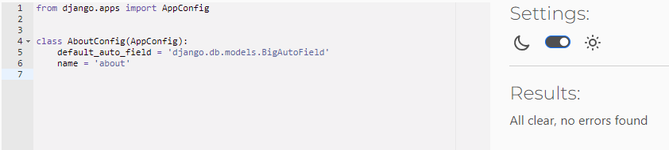
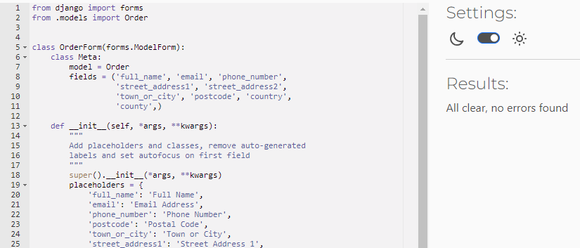
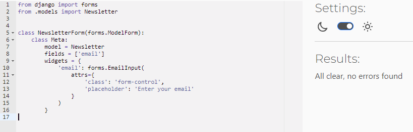
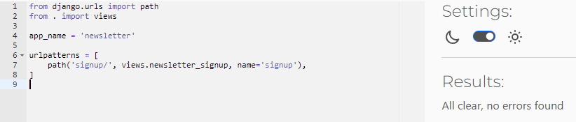

# Seed & Sprout - Testing

Visit the deployed site: [Seed & Sprout](https://seedandsprout-ab1eae7ba537.herokuapp.com/)

Return back to the [README.md](README.md) file.

- - -

## AUTOMATED TESTING

### Code Validation

- [CI Python Linter](https://pep8ci.herokuapp.com/) was used to validate all the Python files.
- [W3C](https://validator.w3.org/) was used to validate the HTML and CSS.
- [JSHint](https://jshint.com/) was used to validate the Javascript.

#### CI Python Linter
**`about app`**
File | Screenshot | Notes |
| --- | --- | --- | 
| about/admin.py |  | Passed. No warnings or errors |
| about/apps.py |  | Passed. No warnings or errors |
| about/forms.py |  | Passed. No warnings or errors |
| about/models.py |  | Passed. No warnings or errors |
| about/urls.py |  | Passed. No warnings or errors |
| about/views.py |  | Passed. No warnings or errors |

**`bag app`**
File | Screenshot | Notes |
| --- | --- | --- | 
| bag/apps.py |  | Passed. No warnings or errors |
| bag/contexts.py |  | Passed. No warnings or errors |
| bag/urls.py |  | Passed. No warnings or errors |
| bag/views.py |  | Passed. No warnings or errors |

**`checkout app`**
File | Screenshot | Notes |
| --- | --- | --- | 
| checkout/admin.py |  | Passed. No warnings or errors |
| checkout/apps.py |  | Passed. No warnings or errors |
| checkout/forms.py |  | Passed. No warnings or errors |
| checkout/models.py |  | Passed. No warnings or errors |
| checkout/signals.py |  | Passed. No warnings or errors |
| checkout/urls.py |  | Passed. No warnings or errors |
| checkout/views.py |  | Passed. No warnings or errors |
| checkout/webhook_handler.py|  | Passed. No warnings or errors |
| checkout/webhooks.py|  | Passed. No warnings or errors |

**`faqs app`**
File | Screenshot | Notes |
| --- | --- | --- | 
| faqs/admin.py |  | Passed. No warnings or errors |
| faqs/apps.py |  | Passed. No warnings or errors |
| faqs/forms.py |  | Passed. No warnings or errors |
| faqs/models.py |  | Passed. No warnings or errors |
| faqs/urls.py |  | Passed. No warnings or errors |
| faqs/views.py |  | Passed. No warnings or errors |

**`home app`**
File | Screenshot | Notes |
| --- | --- | --- |
| home/apps.py |  | Passed. No warnings or errors |
| home/urls.py |  | Passed. No warnings or errors |
| home/views.py |  | Passed. No warnings or errors |

**`newsletter app`**
File | Screenshot | Notes |
| --- | --- | --- | 
| newsletter/admin.py |  | Passed. No warnings or errors |
| newsletter/apps.py |  | Passed. No warnings or errors |
| newsletter/forms.py |  | Passed. No warnings or errors |
| newsletter/models.py |  | Passed. No warnings or errors |
| newsletter/urls.py |  | Passed. No warnings or errors |
| newsletter/views.py |  | Passed. No warnings or errors |

**`products app`**
File | Screenshot | Notes |
| --- | --- | --- | 
| products/admin.py |  | Passed. No warnings or errors |
| products/apps.py |  | Passed. No warnings or errors |
| products/forms.py |  | Passed. No warnings or errors |
| products/models.py |  | Passed. No warnings or errors |
| products/urls.py |  | Passed. No warnings or errors |
| products/views.py |  | Passed. No warnings or errors |
| products/widgets.py |  | Passed. No warnings or errors |

**`profiles app`**
File | Screenshot | Notes |
| --- | --- | --- | 
| profiles/admin.py |  | Passed. No warnings or errors |
| profiles/apps.py |  | Passed. No warnings or errors |
| profiles/forms.py |  | Passed. No warnings or errors |
| profiles/models.py |  | Passed. No warnings or errors |
| profiles/urls.py |  | Passed. No warnings or errors |
| profiles/views.py |  | Passed. No warnings or errors |

**`seed_and_sprout`**
File | Screenshot | Notes |
| --- | --- | --- | 
| settings.py |  | Passed. No warnings or errors |
| urls.py |  | Passed. No warnings or errors |
| views.py |  | Passed. No warnings or errors |
| wsgi.py |  | Passed. No warnings or errors |

#### W3C HTML Validator

Page | Screenshot | Notes |
| --- | --- | --- |
| **Homepage** |  | Passed. No warnings or errors |
| **Products page** |  | Passed. No warnings or errors |
| **Products add page** |  | Passed. No warnings or errors |
| **Products edit page** |  | Passed. No warnings or errors |
| **Products delete page** |  | Passed. No warnings or errors |
| **Products detail page** |  | Passed. No warnings or errors |
| **Bag page** |  | Passed. No warnings or errors |
| **Checkout page** |  | Passed. No warnings or errors |
| **Checkout success page** |  | Passed. No warnings or errors |
| **Faqs page** |  | Passed. No warnings or errors |
| **Faqs add page** |  | Passed. No warnings or errors |
| **Faqs edit page** |  | Passed. No warnings or errors |
| **Faqs delete page** |  | Passed. No warnings or errors |
| **About page** |  | Passed. No warnings or errors |
| **Profile page** |  | Passed. No warnings or errors |
| **Signup page** |  | Passed. No warnings or errors |
| **Signin page** |  | Passed. No warnings or errors |
| **Signout page** |  | Passed. No warnings or errors |

#### W3C CSS Validator

File | Screenshot | Notes |
| --- | --- | --- |
| **base.css** |  | Passed. No warnings or errors |
| **bag.css** |  | Passed. No warnings or errors |
| **checkout.css** |  | Passed. No warnings or errors |
| **faqs.css** |  | Passed. No warnings or errors |
| **home.css** |  | Passed. No warnings or errors |
| **products.css** |  | Passed. No warnings or errors |
| **product_detail.css** |  | Passed. No warnings or errors |
| **profile.css** |  | Passed. No warnings or errors |

#### JSHint Javascript Validator

File | Screenshot | Notes |
| --- | --- | --- |
| **stripe_elements.js** |  | Passed. No warnings or errors |
| **accordion.js** |  | Passed. No warnings or errors |
| **countryfield.js** |  | Passed. No warnings or errors |

- - -

### Lighthouse

I used Lighthouse within the Chrome Developer Tools to test the performance, accessibility, best practices and SEO of the website.

| Page | Screenshot |
| --- | --- | 

- - -

### Responsiveness

- - -

### Browser Compatibility

I have tested my deployed project on two different browsers to check for compatibility issues. I could not find any issues.

| Browser | Main page |
| --- | --- |
| Chrome |  | 
| Edge |  | 

- - -

## MANUAL TESTING

### Testing User Stories
Here's a table for testing the various user stories of the project. The aim is to follow up the functionality implementation.

| Title | User Story | Response | 
| --- | --- | --- |

- - -

### Defensive Programming

- - -

### Bugs